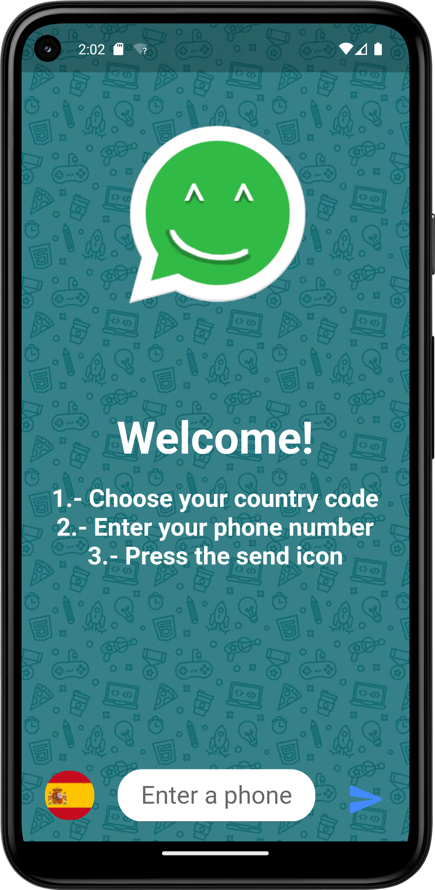
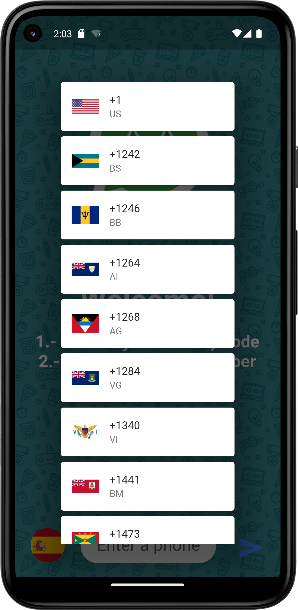

 


 # WhatsApp Direct
Opens a phone number on a WhatsApp chat

# Platform Tested Compatibility

- [x] android

# Dependencies
All plugins used on this project
```
dependencies :
  url_launcher: ^6.1.7
  flutter_launcher_icons: ^0.11.0

```

# Permissions
All permissions required for this application
```
    <uses-permission android:name="android.permission.INTERNET"/>

```

 # Screens


